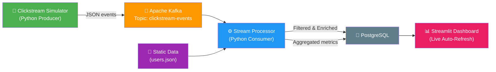

# Real-Time E-Commerce Clickstream Pipeline dengan Apache Kafka

## Deskripsi

Membangun pipeline data streaming real-time yang mensimulasikan **clickstream e-commerce** — tracking aktivitas user (view product, add to cart, purchase) lalu memprosesnya secara real-time untuk menghasilkan analytics seperti **produk paling banyak dilihat dalam 1 menit terakhir (windowing)**, **deteksi aktivitas mencurigakan (filtering)**, dan **enrichment data user**.

### Studi Kasus
**E-Commerce Clickstream Analytics** — Sebuah toko online ingin memantau aktivitas pengunjung secara real-time:
- Produk mana yang sedang trending (paling banyak dilihat per menit)
- Aktivitas mencurigakan (bot detection — terlalu banyak request dalam waktu singkat)
- Profil user enrichment (mencocokkan ID user dengan data profil statis)

### Tech Stack
| Komponen | Teknologi |
|---|---|
| Data Source & Producer | Python (`confluent-kafka`) — simulator clickstream |
| Message Broker | Apache Kafka (via Docker) |
| Stream Processor | Python (`confluent-kafka` consumer + logic) |
| Storage | PostgreSQL |
| Visualization | Streamlit (live dashboard) |
| Orchestration | Docker Compose |

---

## Arsitektur Sistem



### Topologi Kafka
- **Topic**: `clickstream-events`
  - **Partitions**: 3 — untuk paralelisme konsumsi dan distribusi beban berdasarkan `user_id` sebagai key
  - **Replication Factor**: 1 (single broker untuk development, bisa di-scale ke 3 di production)
- **Consumer Group**: `clickstream-processor-group` — memungkinkan horizontal scaling processor

> [!NOTE]
> Alasan 3 partisi: Membagi beban berdasarkan hash `user_id`, sehingga semua event dari user yang sama masuk ke partisi yang sama (penting untuk windowing per-user). Jumlah ini juga cocok untuk demo dengan 1-3 consumer.

---

## Skema Data

### Event Clickstream (Producer → Kafka)
```json
{
  "event_id": "evt-uuid-123",
  "user_id": "user_042",
  "event_type": "view_product",       // view_product | add_to_cart | purchase | search
  "product_id": "prod_089",
  "product_name": "Wireless Mouse Logitech M331",
  "product_category": "Electronics",
  "product_price": 250000,
  "session_id": "sess-abc-456",
  "timestamp": "2026-06-08T20:15:30.123Z",
  "device": "mobile",                 // mobile | desktop | tablet
  "ip_address": "192.168.1.42"
}
```

### Static User Data (untuk Enrichment)
```json
{
  "user_042": {
    "name": "Budi Santoso",
    "age": 28,
    "city": "Jakarta",
    "membership": "gold"
  }
}
```

### Data Setelah Processing (→ PostgreSQL)

**Tabel `processed_events`** — Event yang sudah di-filter dan di-enrich:
| Column | Type | Deskripsi |
|---|---|---|
| event_id | VARCHAR(50) PK | ID unik event |
| user_id | VARCHAR(20) | ID user |
| user_name | VARCHAR(100) | Dari enrichment |
| user_city | VARCHAR(50) | Dari enrichment |
| membership | VARCHAR(20) | Dari enrichment |
| event_type | VARCHAR(20) | Jenis event |
| product_id | VARCHAR(20) | ID produk |
| product_name | VARCHAR(100) | Nama produk |
| product_category | VARCHAR(50) | Kategori |
| product_price | DECIMAL | Harga |
| device | VARCHAR(10) | Device type |
| is_suspicious | BOOLEAN | Flagged oleh filter |
| processed_at | TIMESTAMP | Waktu diproses |

**Tabel `product_views_per_minute`** — Hasil aggregation windowing:
| Column | Type | Deskripsi |
|---|---|---|
| id | SERIAL PK | Auto-increment |
| window_start | TIMESTAMP | Awal window 1 menit |
| window_end | TIMESTAMP | Akhir window 1 menit |
| product_id | VARCHAR(20) | ID produk |
| product_name | VARCHAR(100) | Nama produk |
| view_count | INTEGER | Jumlah view dalam window |
| unique_users | INTEGER | Jumlah user unik |

**Tabel `suspicious_activities`** — Hasil filtering:
| Column | Type | Deskripsi |
|---|---|---|
| id | SERIAL PK | Auto-increment |
| user_id | VARCHAR(20) | ID user |
| event_count | INTEGER | Jumlah event dalam window |
| window_start | TIMESTAMP | Awal window |
| detected_at | TIMESTAMP | Waktu deteksi |
| reason | VARCHAR(200) | Alasan flagging |

---

## Proposed Changes

### Struktur Direktori Proyek

```
data-streaming-kafka/
├── docker-compose.yml              # Kafka + Zookeeper + PostgreSQL
├── requirements.txt                # Python dependencies
├── README.md                       # Panduan menjalankan sistem
├── Instruksi_tugas.md              # (sudah ada)
├── config/
│   └── init.sql                    # DDL untuk buat tabel PostgreSQL
├── data/
│   ├── users.json                  # Static user data untuk enrichment
│   └── products.json               # Static product catalog
├── producer/
│   └── clickstream_producer.py     # Kafka Producer - simulator clickstream
├── processor/
│   └── stream_processor.py         # Kafka Consumer + Processing logic
│       # - Filtering (bot detection)
│       # - Aggregation (product views per minute - windowing)
│       # - Enrichment (gabung data user statis)
├── dashboard/
│   └── app.py                      # Streamlit dashboard (live update)
└── docs/
    └── arsitektur.md               # Diagram & penjelasan arsitektur
```

---

### 1. Infrastructure (Docker)

#### [NEW] [docker-compose.yml](file:///d:/WWN/BigData/data-streaming-kafka/docker-compose.yml)
- **Zookeeper**: Koordinator Kafka
- **Kafka Broker**: Single broker, port 9092 (internal) dan 29092 (external/host)
- **PostgreSQL**: Database untuk storage, port 5432
- Auto-create topic `clickstream-events` dengan 3 partitions via environment variable
- Init SQL script untuk create tabel saat PostgreSQL pertama kali jalan

#### [NEW] [config/init.sql](file:///d:/WWN/BigData/data-streaming-kafka/config/init.sql)
- DDL untuk membuat 3 tabel: `processed_events`, `product_views_per_minute`, `suspicious_activities`

---

### 2. Static Data

#### [NEW] [data/users.json](file:///d:/WWN/BigData/data-streaming-kafka/data/users.json)
- 20 user profiles dengan field: name, age, city, membership (bronze/silver/gold/platinum)
- Digunakan oleh stream processor untuk enrichment

#### [NEW] [data/products.json](file:///d:/WWN/BigData/data-streaming-kafka/data/products.json)
- 30 produk e-commerce dengan field: product_id, name, category, price
- Digunakan oleh producer untuk generate realistic events

---

### 3. Producer

#### [NEW] [producer/clickstream_producer.py](file:///d:/WWN/BigData/data-streaming-kafka/producer/clickstream_producer.py)
- Mensimulasikan clickstream e-commerce secara realistis
- **Rate**: ~20-30 events/detik (memenuhi requirement 10-50 msg/detik)
- **Format**: JSON terstruktur
- **Key**: `user_id` (untuk partitioning yang konsisten)
- **Event types**: `view_product` (60%), `search` (20%), `add_to_cart` (15%), `purchase` (5%)
- Mensimulasikan beberapa "bot user" yang generate traffic tinggi (untuk memancing filtering)
- Delivery report callback untuk monitoring

---

### 4. Stream Processor

#### [NEW] [processor/stream_processor.py](file:///d:/WWN/BigData/data-streaming-kafka/processor/stream_processor.py)
Ini komponen **paling penting** (bobot 30%). Implementasi:

1. **Filtering** (Bot Detection):
   - Tracking jumlah event per user dalam sliding window 30 detik
   - Jika user mengirim > 15 events dalam 30 detik → flagged sebagai suspicious
   - Event suspicious tetap diproses tapi ditandai `is_suspicious = true`
   - Record disimpan ke tabel `suspicious_activities`

2. **Aggregation** (Windowing):
   - Tumbling window 1 menit
   - Menghitung jumlah view per produk dalam setiap window
   - Menghitung jumlah unique users per produk
   - Hasil disimpan ke tabel `product_views_per_minute`

3. **Enrichment**:
   - Membaca `data/users.json` saat startup
   - Setiap event di-enrich dengan data user (name, city, membership)
   - Event + enrichment disimpan ke tabel `processed_events`

---

### 5. Dashboard (Streamlit)

#### [NEW] [dashboard/app.py](file:///d:/WWN/BigData/data-streaming-kafka/dashboard/app.py)
Dashboard interaktif dengan **auto-refresh setiap 5 detik**:

- **📈 Real-Time Metrics Bar**: Total events, events/menit, unique users aktif, suspicious count
- **🔥 Trending Products (1 Menit Terakhir)**: Bar chart top 10 produk paling banyak dilihat — hasil windowing
- **📊 Event Type Distribution**: Pie chart breakdown event types
- **🚨 Suspicious Activity Alerts**: Tabel alert real-time untuk bot-detected users
- **📋 Live Event Feed**: Tabel scrollable 50 event terakhir yang masuk
- **📈 Event Timeline**: Line chart jumlah event per menit

---

### 6. Documentation

#### [NEW] [README.md](file:///d:/WWN/BigData/data-streaming-kafka/README.md)
- Deskripsi proyek & studi kasus
- Diagram arsitektur
- Prasyarat (Docker, Python 3.9+)
- Langkah-langkah menjalankan: `docker-compose up` → install deps → run producer → run processor → run dashboard
- Penjelasan topologi Kafka
- Screenshots dashboard

#### [NEW] [requirements.txt](file:///d:/WWN/BigData/data-streaming-kafka/requirements.txt)
- `confluent-kafka`
- `psycopg2-binary`
- `streamlit`
- `pandas`
- `plotly`

---

## Processing Logic Detail

### Filtering — Bot Detection
```python
# Sliding window 30 detik
user_event_window = defaultdict(list)  # user_id -> [timestamps]

def is_suspicious(user_id, current_time):
    # Hapus event yang lebih dari 30 detik lalu
    window = [t for t in user_event_window[user_id] if current_time - t < 30]
    user_event_window[user_id] = window
    window.append(current_time)
    return len(window) > 15  # threshold: 15 events / 30 detik
```

### Aggregation — Tumbling Window 1 Menit
```python
# Tumbling window 1 menit
current_window = {}  # (product_id, window_start) -> {count, unique_users}

def aggregate_view(event):
    window_start = event['timestamp'].replace(second=0, microsecond=0)
    key = (event['product_id'], window_start)
    if key not in current_window:
        current_window[key] = {'count': 0, 'users': set()}
    current_window[key]['count'] += 1
    current_window[key]['users'].add(event['user_id'])

# Flush expired windows ke PostgreSQL setiap loop
```

### Enrichment
```python
# Load static data saat startup
with open('data/users.json') as f:
    users_db = json.load(f)

def enrich_event(event):
    user = users_db.get(event['user_id'], {})
    event['user_name'] = user.get('name', 'Unknown')
    event['user_city'] = user.get('city', 'Unknown')
    event['membership'] = user.get('membership', 'none')
    return event
```

---

## Verification Plan

### Automated Tests
```bash
# 1. Start infrastructure
docker-compose up -d

# 2. Verify Kafka & PostgreSQL are running
docker-compose ps

# 3. Install dependencies
pip install -r requirements.txt

# 4. Run producer (terminal 1)
python producer/clickstream_producer.py

# 5. Run processor (terminal 2)
python processor/stream_processor.py

# 6. Run dashboard (terminal 3)
streamlit run dashboard/app.py
```

### Manual Verification
1. **Producer**: Pastikan log menunjukkan ~20-30 msg/detik terkirim ke Kafka
2. **Processor**: Pastikan log menunjukkan event di-consume, di-filter, di-aggregate, dan di-enrich
3. **PostgreSQL**: Query manual ke tabel untuk memastikan data masuk
4. **Dashboard**: Buka browser → pastikan charts auto-refresh dan data berubah real-time
5. **Bot Detection**: Verifikasi bahwa simulated bot users muncul di suspicious activities

---

## User Review Required

> [!IMPORTANT]
> **Database choice**: Anda memilih PostgreSQL + Streamlit. Kombinasi ini solid dan profesional. Pastikan Docker Desktop sudah terinstall di komputer Anda.

> [!NOTE]
> **Scope tugas kelompok**: Dengan 2-3 anggota, pembagian kerja bisa:
> - **Anggota 1**: Producer + Static Data
> - **Anggota 2**: Stream Processor (Filtering + Aggregation + Enrichment)
> - **Anggota 3**: Dashboard + Documentation
>
> Atau jika mandiri, semua dikerjakan secara berurutan.

## Open Questions

> [!IMPORTANT]
> 1. Apakah Docker Desktop sudah terinstall di komputer Anda? Ini diperlukan untuk menjalankan Kafka dan PostgreSQL.
> 2. Apakah Anda ingin dashboard Streamlit menggunakan tema gelap (dark mode) atau terang?
> 3. Apakah ada preferensi khusus untuk jumlah produk/user dalam data simulasi, atau 20 users + 30 produk sudah cukup?
